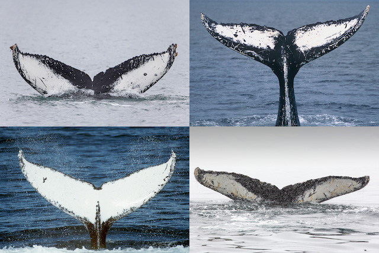

# Humpback Whale Identification



## Overview

### Goal

Build an algorithm to identify individual whales by images of their tails. 

### Dataset

Happywhale’s database of over 25,000 images, gathered from research institutions and public contributors. There's also ~5000 known whale Ids. There're only a few examples of each Id.  

### Evaluation

_Mean Average Percision_:
$$
MAP@5 = {1 \over U} \sum_{u=1}^U \sum_{k=1}^{min(n,5)} P(k)×rel(k)
$$
where U is the number of images, P(k)P(k) is the precision at cutoff kk, nn is the number predictions per image, and rel(k)rel(k) is an indicator function equaling 1 if the item at rank kk is a relevant (correct) label, zero otherwise.

### Submission Format

```
Image,Id 
00028a005.jpg,new_whale w_23a388d w_9b5109b w_9c506f6 w_0369a5c 
000dcf7d8.jpg,new_whale w_23a388d w_9b5109b w_9c506f6 w_0369a5c 
...
```

## Approach

We've mplemented a triplet network, based on Google's FaceNet paper, to extracts high level low dimensional features which are used successfully in whale fluke similarity search. 

### References

- [assignment paper](./mmn_competition_cv.pdf)
- [kaggle competition](https://www.kaggle.com/c/humpback-whale-identification)
- [basis paper](https://arxiv.org/pdf/1503.03832.pdf)

## Notebooks

1. Exploratory analysis 
2. Preprocessing
3. Training, validation, evaluation


